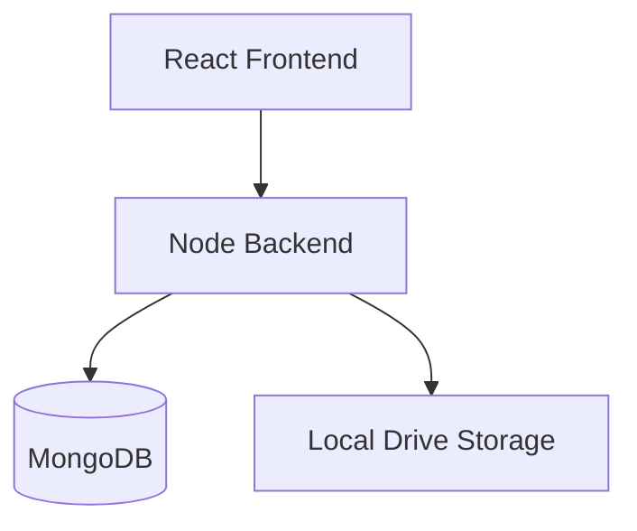

# 🎬 CineVault


🚀 Self-hosted media server. Automatic ingestion, metadata fetching, and fluid streaming.

## 🎬 Demo


## ⚡ Quick Start

```bash
git clone https://github.com/mosesrb/CineVault.git
cd CineVault
npm install
npm run fullstack
```
Open browser: `http://localhost:3000`

## 🧠 How It Works

1. Add movie path.
2. System ingests files.
3. Auto-fetches metadata (posters, cast).
4. Stores in MongoDB.
5. Streams via UI.

## ✨ Key Features

- **Auto Organization**: Hands-free library prep.
- **Mobile First**: Touch-optimized UI. No clunky grids.
- **Offline Downloads**: Robust Android sync. No ghosting.

## 🏗 Architecture



## 📜 License
This project licensed under GPL-v3.
