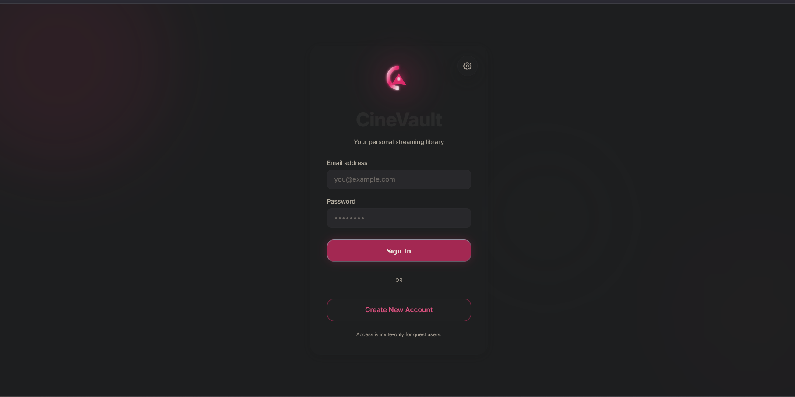

<h1>
  
  <span style="vertical-align: middle;">CineVault</span>
</h1>
<h1 style="display: flex; align-items: center; gap: 10px;">
  
  <span>CineVault</span>
</h1>


## 🎬 How it Looks



CineVault is a personal media sanctuary. I built it because I wanted a self-hosted alternative that handles the complex parts of media management—like metadata fetching and adaptive streaming—without feeling like a bloated enterprise app.

## ✨ What makes it cool?

- **Real Streaming (HLS)**: It doesn't just "buff" the whole file. It uses an adaptive HLS delivery system with real-time transcoding. If your connection is slow, it adapts. If your device doesn't support the codec, CineVault handles it on the fly.
- **Smart Metadata Scoring**: No more manual poster editing. The built-in metadata engine uses a heuristic scoring system to match your files against TMDB. It even detects ambiguous titles and helps you resolve them.
- **Built for Moving**: Designed as a mobile-first experience. The offline sync uses a hardened "Task-ID" protocol to ensure your downloads finish even if the network flickers.
- **Hands-Free Ingestion**: Just drop a file in your library folder. The background scanner detects it, fetches the cast/crew/trailers, and adds it to your collection.

## 🚀 Getting Started

1. **Clone & Install**:
   ```bash
   git clone https://github.com/mosesrb/CineVault.git
   cd CineVault
   npm install
   ```
2. **Configure**: Rename `.env.sample` to `.env` and add your MongoDB URI and TMDB API Key.
3. **Run**:
   ```bash
   npm run fullstack
   ```
   Open `http://localhost:3000` and start your collection.

## 🏗 The Tech
Built with a Node.js/Express backend and a React frontend. It uses MongoDB for the library data and FFmpeg for the heavy lifting of media transcoding. 

---
*Created with ❤️ for private collections.*
