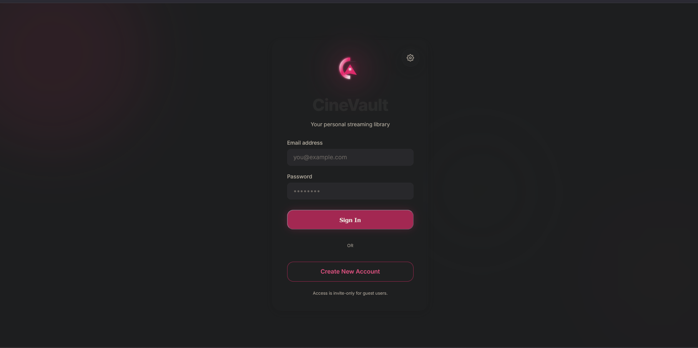

# CineVault

[](LICENSE)
[](https://nodejs.org/)
[](https://react.dev/)
[](https://capacitorjs.com/)

CineVault is a self-hosted media server and streaming client for personal movie and TV show collections. It provides on-the-fly video transcoding, automated metadata matching from TMDB, and playback across desktop browsers, Android phones, and Android TV devices.

---

## Overview



CineVault consists of an Express/Node.js backend and a React/Capacitor frontend. The backend scans local directories, indexes media files into MongoDB, pulls metadata from TMDB, and streams content using FFmpeg. The frontend provides a responsive interface designed for mouse, touch, and TV remote controls.

---

## Core Features

- **Adaptive Video Streaming**: Real-time HLS transcoding and remuxing via FFmpeg, with support for multi-track audio and subtitle selection.
- **Multi-Platform Playback**:
  - **Desktop Web**: Full keyboard shortcuts, theater mode, picture-in-picture, and volume memory.
  - **Android Mobile**: Touch-optimized player with double-tap seek gestures (+5s / -5s with live accumulation HUD) and automatic fullscreen orientation locking.
  - **Android TV**: Native Leanback launcher support, 10-foot UI safe margins, and D-Pad focus navigation.
- **Automated Metadata & Organization**: File name parsing and heuristic matching against The Movie Database (TMDB) for posters, backdrops, cast details, genres, and release years.
- **Media Lightbox Viewer**: Full-screen photo gallery for backdrops and posters with touch swiping and keyboard/remote navigation.
- **Vault Administration**: Web-based admin dashboard for monitoring active streaming sessions, managing library roots, triggering rescans, and updating TMDB API keys.
- **Stream Security & Privacy**: Ephemeral 2-minute stream tickets for media playback endpoints, local network auto-discovery, and zero external telemetry.

---

## Tech Stack

| Layer | Technologies |
| :--- | :--- |
| **Backend** | Node.js, Express, MongoDB (Mongoose), Redis, FFmpeg |
| **Frontend** | React 18, Vite, Lucide React |
| **Mobile & TV** | Capacitor 8 (Android & Android TV Leanback) |
| **Testing** | Jest (Backend integration tests), Vitest & React Testing Library (Frontend) |

---

## Quick Start

### Prerequisites

- **Node.js** v18.0.0 or higher
- **MongoDB** v5.0+ running locally or via Docker
- **FFmpeg** installed and accessible in your system `PATH`

### 1. Installation

```bash
git clone https://github.com/mosesrb/CineVault.git
cd CineVault

# Install backend dependencies
npm install

# Install frontend dependencies
npm install --prefix frontend
```

### 2. Environment Configuration

Create a `.env` file in the root directory (refer to `.env.sample`):

```env
# Required: Secret key used to sign authentication tokens
delatron_jwtPrivateKey=your_jwt_secret_key

# Required: MongoDB connection string
delatron_MONGODB_URI=mongodb://localhost:27017/cinevault

# Optional: TMDB API key (can also be configured in the admin dashboard)
delatron_TMDB_API_KEY=your_tmdb_api_key
```

### 3. Running Locally

```bash
# Start backend API and frontend dev server concurrently
npm run fullstack
```

The web application will be available at `http://localhost:3000` (API running on `http://localhost:5000`).

---

## Docker Deployment

You can run CineVault alongside MongoDB using Docker Compose:

```bash
docker-compose up -d --build
```

To mount your personal media folders into the container, update the `volumes` section in `docker-compose.yml`:

```yaml
volumes:
  - /path/to/your/movies:/media/movies:ro
  - /path/to/your/tvshows:/media/tvshows:ro
```

---

## Testing

Run backend and frontend test suites:

```bash
# Backend integration tests (Jest)
npm test

# Frontend unit and component tests (Vitest)
npm test --prefix frontend
```

---

## Building the Android App

```bash
# 1. Build frontend assets
npm run build --prefix frontend

# 2. Sync web assets with Capacitor Android project
cd frontend
npx cap sync android

# 3. Open in Android Studio to build APK or run on device/emulator
npx cap open android
```

---

## License

This project is licensed under the [GNU General Public License v3.0 (GPLv3)](LICENSE).

