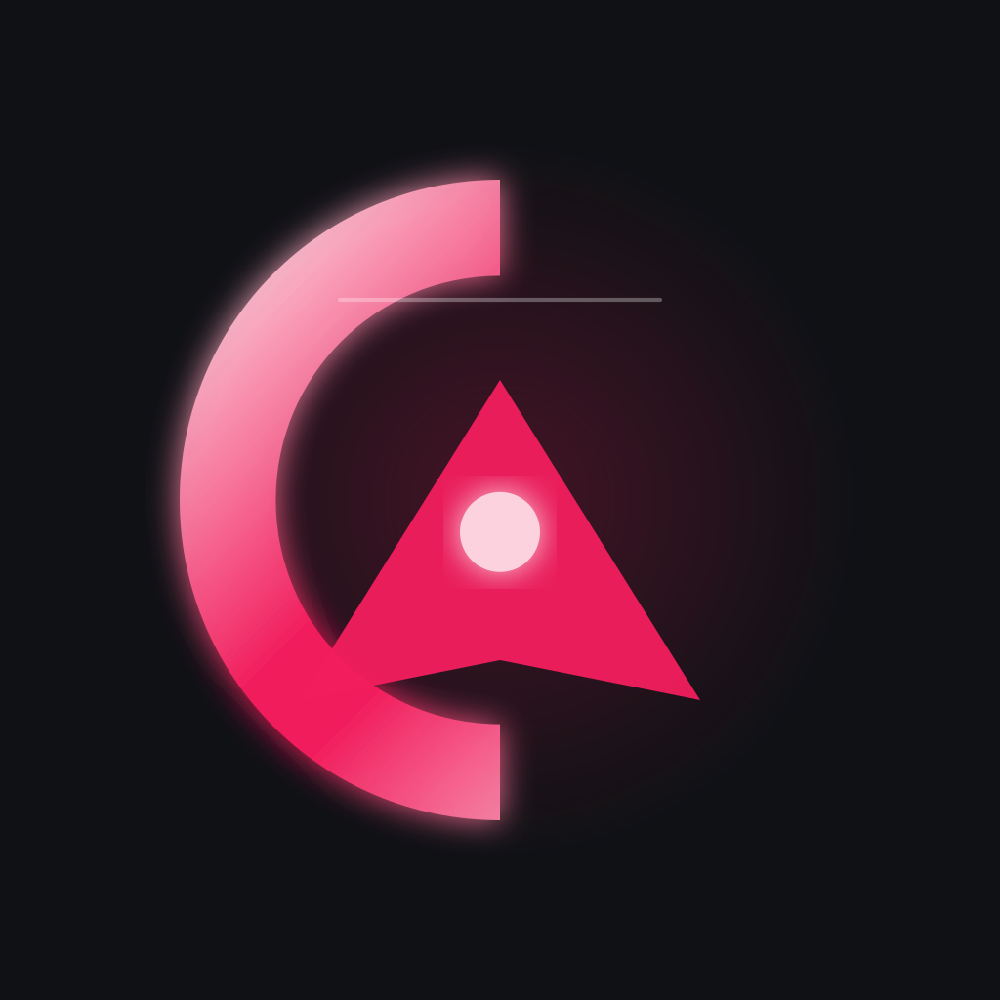
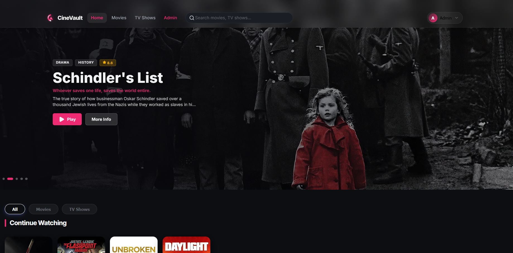
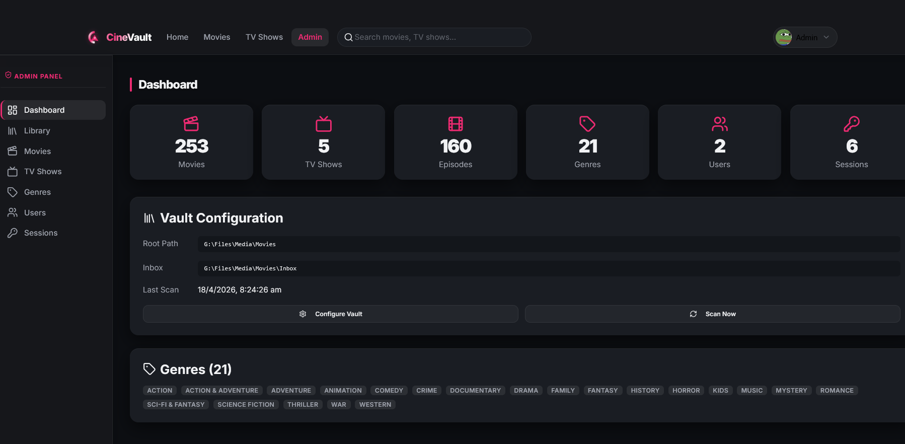

#  CineVault

[](LICENSE)
[](https://nodejs.org/)
[](https://react.dev/)
[](https://capacitorjs.com/)
[-brightgreen.svg)]()

**CineVault** is an ultra-fast, privacy-first, self-hosted streaming and personal media sanctuary. Built from the ground up for film collectors, families, and media enthusiasts who want intelligent metadata resolution, real-time adaptive HLS streaming, multi-device playback, and offline sync without the telemetry or bloat of enterprise ecosystems.

---

## 🎬 Screenshots & User Interface

### 🔐 Authentication & Server Connection
> *Spacious glassmorphic login interface with LAN IP auto-discovery, custom server connection configuration, and dark-theme edge-to-edge support on mobile.*


### 🍿 Hero Discovery & Media Carousel
> *Dynamic carousel discovery, high-fidelity backdrops, interactive watchlists, and instant metadata preview.*



### 🛠️ Vault Administration & Dynamic Settings
> *Vault storage root management, real-time ingestion status, interactive file cleanup, active streaming session monitors, and dynamic TMDB API key configuration.*



---

## ✨ Key Features & Architectural Highlights

### ⚡ Adaptive HLS Streaming Engine
- **Real-Time Transcoding & Remuxing**: Leverages FFmpeg to transcode on-the-fly into adaptive HTTP Live Streaming (`.m3u8` playlists and `.ts` video chunks).
- **Process Lifecycle Management**: Automatically manages and terminates orphan FFmpeg child processes upon stream termination or client disconnect.
- **Path Traversal Security**: Strict containment checks ensure video segments and master files cannot escape the configured Vault roots.

### 🧠 Intelligent Metadata Scoring & Normalization
- **Multi-Pass TMDB Matching**: Strips resolution tags (`1080p`, `4K`, `BluRay`, `HEVC`), release groups, and codec flags while preserving Roman numerals and subtitle indicators.
- **Dynamic TMDB API Key Configuration**: Allows administrators to input and test TMDB credentials directly in the Admin Panel without restarting backend services.
- **Deduplication Engine**: Automatically aggregates genres, cast, crew, and high-resolution posters into MongoDB without duplicate key collisions.

### 📱 Android & Mobile-First Excellence
- **Hardware Back Button Handling**: Smart event-driven back navigation intercepts hardware back gestures inside modals, document readers, and navigation stacks without exiting the app.
- **Capacitor Integration**: Native Android APK wrapping with LAN auto-detection and offline download capabilities via the Task-ID sync protocol.
- **In-Place Legal & Privacy Viewer**: Capsule-segmented modals allow immediate, touch-protected reading of Privacy Policies and Terms of Service right on mobile screens.

### 🛡️ Privacy & Zero Telemetry
- **100% Self-Hosted**: All user data, streaming history, sessions, and files stay exclusively on your own network.
- **Zero Third-Party Tracking**: No analytics trackers, external beacons, or remote telemetry.

---

## 🚀 Quick Start Guide

### Prerequisites
- **Node.js**: v18.0.0 or higher
- **MongoDB**: v5.0+ running locally or in Docker
- **FFmpeg**: Installed and available in your system `$PATH`

### 1. Clone & Install
```bash
git clone https://github.com/mosesrb/CineVault.git
cd CineVault
npm install
npm install --prefix frontend
```

### 2. Configure Environment
Create a `.env` file in the root directory (or copy from `.env.sample`):
```env
# Required: Secret for signing JWT tokens
delatron_jwtPrivateKey=your_super_secret_jwt_key_here

# Required: MongoDB database URI
delatron_MONGODB_URI=mongodb://localhost:27017/cinevault_production

# Optional: The Movie Database API Key (can also be configured via Admin UI)
delatron_TMDB_API_KEY=your_tmdb_api_key_here
```

### 3. Launch Development Environment
```bash
# Run backend and frontend concurrently
npm run fullstack
```
Access the web application at `http://localhost:3000`.

---

## 🐳 Docker Deployment

Run CineVault with MongoDB and FFmpeg in isolated containers:
```bash
docker-compose up -d --build
```
Your media files can be mapped into the container by setting volume paths in `docker-compose.yml`.

---

## 🧪 Testing & Validation

CineVault features test suites across both backend and frontend layers:

```bash
# Run Backend Integration Tests (Jest)
npm test

# Run Frontend Component & UI Tests (Vitest)
npm test --prefix frontend
```

---

## 📜 License
This project is licensed under the **GNU General Public License v3 (GPLv3)**. See the [LICENSE](LICENSE) file for details.

*Crafted with ❤️ for personal film collectors and private home cinemas.*
