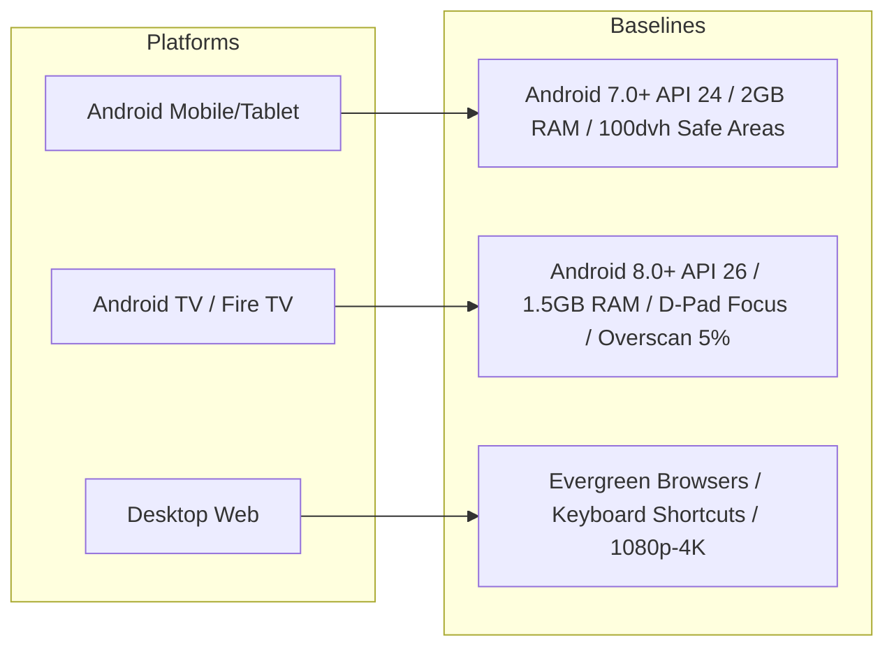
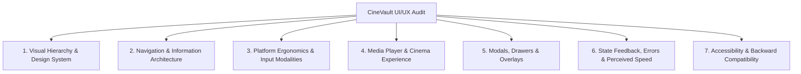
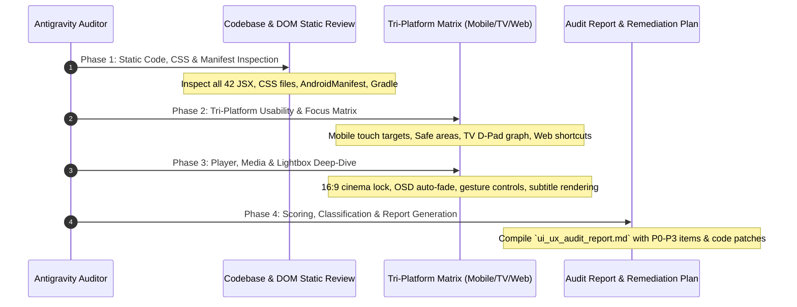

# CineVault Multi-Platform UI/UX & Usability Audit Plan

> **Version:** 1.0.0  
> **Target Scope:** Android Mobile & Tablet, Android TV / Fire TV (10-Foot UI), Desktop & Responsive Web  
> **Project:** CineVault (Delatron Media Server & Client)  
> **Status:** Approved / Ready for Execution  

---

## 1. Executive Summary & Objective

The objective of this audit is to conduct a rigorous, end-to-end UI/UX and usability evaluation of CineVault across its three primary form factors:
1. **Android Mobile & Tablet** (Touch-first, gesture-driven, native Capacitor integration)
2. **Android TV & Google TV / Fire TV** (10-foot viewing distance, remote control D-Pad navigation, Leanback guidelines)
3. **Desktop & Responsive Web** (Mouse/keyboard navigation, variable viewport scaling, high-density displays)

This plan defines the parameters, evaluation dimensions, backward compatibility baselines, scoring mechanisms, and execution phases required to produce a production-ready, frictionless cinema streaming experience.

---

## 2. Platform Profiles & System Requirements



### 2.1 Minimum Hardware & OS Support Baselines

| Parameter | Android Mobile & Tablet | Android TV & Streaming Sticks | Desktop Web |
| :--- | :--- | :--- | :--- |
| **Minimum OS Floor** | Android 7.0 (Nougat, API 24) *(Capacitor 8 limit)* | Android 8.0 (Oreo, API 26) / Fire OS 6 | Modern Evergreen (Chrome 80+, Firefox 78+, Safari 14+) |
| **Target Baseline** | Android 10.0+ (API 29+) | Android 9.0 (Pie) / Android 11 (Google TV) | Last 2 stable major releases |
| **Minimum RAM** | 2.0 GB | 1.5 GB (1.0 GB with UI throttling) | 4.0 GB |
| **Processor / SoC** | Octa-core ARM64 (Snapdragon 600+ / Helio G80+) | Quad-Core ARM Cortex-A53 @ 1.2 GHz+ | Any modern dual-core x86/ARM |
| **Video Decoding** | Hardware H.264 (AVC) / H.265 (HEVC) | Hardware H.264 Level 4.1+ / H.265 / VP9 | Hardware Accelerated MSE / HLS.js |
| **Input Modality** | Multi-touch, hardware back button | 5-way D-Pad Remote (Up/Down/Left/Right/OK/Back) | Mouse pointer, keyboard, scroll wheel |

### 2.2 Backward Compatibility & Legacy TV Considerations
* **Frozen WebView Resilience**: Older TV boxes and budget streaming sticks (e.g., Fire TV Stick Lite, generic Amlogic TV boxes) may run older Chromium WebViews (Chromium 70–90). All modern CSS features (`min-height: 100dvh`, `backdrop-filter: blur()`, CSS Nesting) must have functional solid-color/standard-unit fallbacks.
* **Leanback Manifest Compliance**: Verify `AndroidManifest.xml` explicitly declares:
  * `<category android:name="android.intent.category.LEANBACK_LAUNCHER" />`
  * `<uses-feature android:name="android.hardware.touchscreen" android:required="false" />`
  * Android TV 16:9 Banner Asset (`android:banner`).
* **GPU & Memory Throttling**: Low-end TV SoCs suffer severe frame drops under heavy box shadows or non-hardware-accelerated CSS animations.

---

## 3. The 7 Core Evaluation Dimensions

The audit evaluates all screens and components across seven structured dimensions:



### Dimension 1: Visual Hierarchy & Design Tokens
* **Theme Consistency**: Cohesion of dark cinematic theme tokens (`#0f172a`, `#1e293b`, `#e2e8f0`, `#38bdf8`, accent gold/cyan).
* **Typography Hierarchy**: Clear scale from page titles (h1) down to metadata captions (year, rating, runtime, audio codecs).
* **Grid & Spacing Rhythm**: Uniform 4px / 8px spacing increments; alignment of media cards across shelf carousels.
* **Image Framing & Aspect Ratios**: Poster cards (2:3), backdrop headers (16:9), and gallery stills.

### Dimension 2: Navigation & Information Architecture
* **Navigation Adaptability**:
  * *Mobile*: Fixed bottom navigation bar with safe-area spacing.
  * *Desktop*: Sticky glassmorphic top navigation header.
  * *Android TV*: Spatial top/side navigation bar reachable by D-Pad Up/Left.
* **Route Transitions**: Instantaneous, flicker-free transitions between Home, Movies, TV Shows, Detail, and Admin views.
* **History & Deep Linking**: Predictable forward/back history state; hardware back button pops modal before exiting route.

### Dimension 3: Platform Ergonomics & Input Modalities
* **Touch Targets (Mobile)**: Minimum 48 × 48 dp hit area for all interactive controls (play buttons, filter chips, pagination, download buttons).
* **Safe-Area Insets (Mobile)**: `env(safe-area-inset-top)` and `env(safe-area-inset-bottom)` applied to prevent notch/home-bar collision.
* **Spatial D-Pad Focus (Android TV)**:
  * Visible focus indicators (scale up, glowing ring, bright borders) with `:focus-visible` states.
  * Logical 2D directional traversal without focus getting lost off-screen.
  * No reliance on mouse hover events to reveal critical actions.
* **Keyboard & Mouse (Web)**: Intuitive hover states, cursor indicators (`cursor: pointer`), and keyboard shortcuts (`Escape`, `ArrowLeft/Right`, `Spacebar`).

### Dimension 4: Media Player & Cinema Experience (`CinemaPlayer.jsx`, `Player.jsx`)
* **Layout Shift Prevention (CLS)**: Zero cumulative layout shift during video metadata initialization (16:9 cinema aspect ratio container lock).
* **Controls & OSD (On-Screen Display)**:
  * Automatic control fade-out after 3.5s of inactivity.
  * Responsive scrubbing timeline and time display formatting (`MM:SS` / `HH:MM:SS`).
  * Audio track selector and subtitle styling/readability over varied video scenes.
* **Orientation & Fullscreen**: Automatic landscape switch on mobile playback and seamless native fullscreen handling.

### Dimension 5: Modals, Drawers & Overlays
* **Focus Trapping**: Active modal keeps keyboard/D-Pad navigation contained inside the dialog.
* **Dismissal Ergonomics**:
  * Tap outside / backdrop click to dismiss.
  * `Escape` key dismiss on Web.
  * `cv_hardware_back` event intercept on Android Mobile/TV with `e.preventDefault()`.
* **Picture Viewer Lightbox (`ImageViewerModal.jsx`)**:
  * Touch swipe gestures (left/right).
  * TV D-Pad navigation between stills with active thumbnail focus.
  * Image counter and zoom containment.

### Dimension 6: State Feedback, Error Resilience & Perceived Speed
* **Loading States**: Shimmer skeleton cards on media shelves rather than blank screens or jarring shifts.
* **Empty States**: Helpful illustrations and clear call-to-actions for empty watchlists, search queries with no results, or empty vault directories.
* **Error Handling**: Friendly user-facing toasts for stream network drops, transcode timeouts, or failed metadata scans.
* **Form Feedback**: Real-time validation and non-disruptive feedback on `/login`, `/register`, and `/admin/*`.

### Dimension 7: Accessibility (WCAG 2.2 AA) & Backward Compatibility
* **Contrast Ratios**: Minimum 4.5:1 for normal text and 3:1 for graphical UI elements and icons against dark backdrops.
* **Screen Reader & ARIA**: `aria-label` attributes on icon-only buttons (Lucide icons: Play, Info, Close, Filter, Settings).
* **CSS Graceful Degradation**:
  * `height: 100vh` fallback preceding `height: 100dvh`.
  * Solid background fallbacks preceding `backdrop-filter: blur()`.
* **Low-Memory TV Budget**: Lightweight DOM tree, hardware-accelerated transforms (`transform: translate3d(...)`), and absence of memory leaks during long playback sessions.

---

## 4. Scope & Component Inventory

The audit spans the complete frontend surface area (42+ JSX components and CSS stylesheets):

```
frontend/src/
├── App.jsx                           # Root layout, routing, safe areas, global footer gating
├── components/
│   ├── CinemaPlayer.jsx              # Core video player, Vidstack wrapper, HLS controls
│   ├── ImageViewerModal.jsx          # Multi-platform full-screen photo & still viewer
│   ├── MediaShelf.jsx                # Horizontal scrolling media carousels
│   ├── MediaCard.jsx                 # Poster cards, rating badges, hover/focus overlays
│   ├── HeroCarousel.jsx              # Featured banner slider, backdrop imagery, action CTAs
│   ├── FilterDrawer.jsx              # Genre, year, sort slide-out filter drawer
│   ├── Navbar.jsx & MobileNav.jsx    # Top desktop navigation & mobile bottom navigation
│   ├── Footer.jsx                    # Legal, copyright & route-gated footer
│   ├── LegalViewerModal.jsx          # In-place modal for Terms & Privacy
│   ├── LegalConsentModal.jsx         # Registration consent checkbox & modal triggers
│   ├── ConfirmModal.jsx              # Destructive action confirmation dialog
│   └── DownloadButton.jsx            # Mobile offline download status & action
├── pages/
│   ├── Home.jsx, Movies.jsx, TVShows.jsx, Browse.jsx
│   ├── Detail.jsx                    # Movie/Show overview, picture gallery, episode lists
│   ├── Player.jsx                    # Dedicated streaming page & player container
│   ├── Search.jsx                    # Live search, filter integration, zero-state display
│   ├── Profile.jsx                   # User preferences, playback settings, sessions
│   ├── Login.jsx & Register.jsx      # Auth forms, legal consent, safe-area layout
│   └── admin/
│       ├── AdminLayout.jsx, Dashboard.jsx, Library.jsx, MetadataModal.jsx
│       ├── AdminMovies.jsx, AdminTVShows.jsx, AdminGenres.jsx
│       └── AdminUsers.jsx, AdminSessions.jsx
```

---

## 5. Defect Severity & Scoring Matrix

Every identified finding will be cataloged with an exact severity rating:

| Severity Level | Definition & Impact | Resolution SLA / Priority |
| :--- | :--- | :--- |
| **P0 - Critical / Blocker** | Broken navigation, D-Pad focus trap (user stuck), app crash/exit, missing TV launcher declaration, or unclickable primary actions. | Fix immediately prior to beta release. |
| **P1 - High / Severe** | Missing hardware back button intercept, broken layout on older WebViews, touch targets < 48dp, severe CLS during playback start, or WCAG contrast failure on critical text. | Fix in current milestone. |
| **P2 - Medium / Suboptimal** | Inconsistent spacing/padding, missing loading skeletons, lack of empty-state guidance, or minor layout shifts on orientation change. | Schedule in sprint backlog. |
| **P3 - Low / Polish** | Micro-interaction improvements, subtle hover transition tweaks, tooltip polish, or non-critical animation smoothing. | Nice to have / Polish backlog. |

---

## 6. Phased Audit Execution Process



1. **Phase 1: Static Code, CSS & Android Manifest Inspection**
   * Review all CSS modules for safe area variables, viewport units (`dvh` vs `vh`), focus selectors, and blur fallbacks.
   * Inspect `AndroidManifest.xml` for TV Leanback launcher and touchscreen feature declarations.
2. **Phase 2: Tri-Platform Usability & Focus Matrix Evaluation**
   * Walk through each user flow across Mobile (touch/gestures), TV (D-Pad remote), and Web (mouse/keyboard).
3. **Phase 3: Player, Media & Lightbox Deep-Dive**
   * Detailed assessment of `CinemaPlayer`, `ImageViewerModal`, `MediaShelf`, and `HeroCarousel`.
4. **Phase 4: Defect Compilation & Scoring**
   * Aggregate all findings into a structured scorecard categorized by platform and severity (P0–P3).
5. **Phase 5: Remediation Roadmap & Implementation Plan**
   * Deliver clear, drop-in JSX/CSS code solutions and priority-ranked remediation tasks.

---

## 7. Deliverables

Upon completion of the audit, the following artifacts will be produced:
1. **`docs/ui_ux_audit_report.md`**: Comprehensive scorecard, detailed defect logs, and platform comparison matrix.
2. **Implementation Plan & Pull Request**: Verified code updates resolving all P0 and P1 issues.
