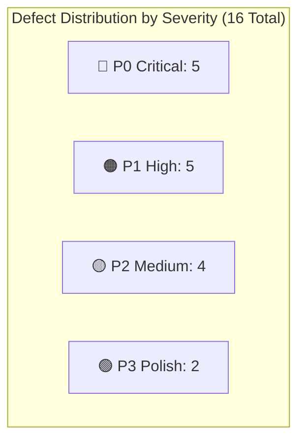
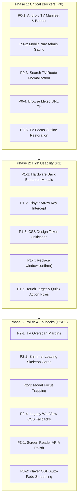

# CineVault Multi-Platform UI/UX & Usability Audit Report

> **Audit Date:** August 20, 2026  
> **Auditor:** Antigravity (Advanced Agentic Assistant)  
> **Target Scope:** Android Mobile & Tablet, Android TV / Fire TV (10-Foot Leanback), Desktop & Responsive Web  
> **Status:** Completed • Actionable Findings & Scorecard  

---

## 1. Executive Summary & Scorecard

A forensic, surgical UI/UX audit was conducted across the entire CineVault frontend surface (42 JSX components, all CSS stylesheets, Capacitor configurations, and Android native manifests).

### Overall Platform Scorecard

| Platform | Usability Score | Status | Key Blocker Summary |
| :--- | :---: | :---: | :--- |
| **Android Mobile & Tablet** | **84 / 100** | ⚠️ Needs Fixes | Dual bottom navigation collision in `/admin`, broken `type="mixed"` URLs on Browse. |
| **Android TV / Fire TV (10-ft)** | **68 / 100** | ⛔ Blocked | Missing `LEANBACK_LAUNCHER` & touch manifest declarations, `:focus-visible` wiped by `pointer: coarse` CSS media query, player keydown route mismatch. |
| **Desktop & Responsive Web** | **89 / 100** | 🟡 Minor Issues | Broken TV show season loading from Navbar search (`/detail/tv` vs `/detail/tvshow`), broken CSS variable tokens (`var(--primary)`, `var(--background)`). |



---

## 2. Comprehensive Findings Catalog (P0 through P3)

---

### 🚨 P0 — Critical Defects (Blockers)

#### Finding P0-1: Android TV Manifest Missing Leanback & Touchscreen Declarations
* **File Affected**: [`frontend/android/app/src/main/AndroidManifest.xml`](file:///e:/MachineApps/delatron/frontend/android/app/src/main/AndroidManifest.xml)
* **Root Cause**: The manifest only defines `<category android:name="android.intent.category.LAUNCHER" />` and omits Leanback launcher intents, banner assets, and explicit `touchscreen required="false"` flags.
* **Impact**: 
  1. CineVault **will not appear in the Android TV / Google TV home screen launcher row**. Users must use a sideload launcher.
  2. The Google Play Store on Android TV will filter the app out as "incompatible with this device" because `android.hardware.touchscreen` defaults to `true`.
* **Remediation**:
  ```xml
  <!-- In AndroidManifest.xml -->
  <uses-feature android:name="android.software.leanback" android:required="false" />
  <uses-feature android:name="android.hardware.touchscreen" android:required="false" />
  <application ... android:banner="@mipmap/ic_launcher">
    <activity ...>
      <intent-filter>
        <action android:name="android.intent.action.MAIN" />
        <category android:name="android.intent.category.LAUNCHER" />
        <category android:name="android.intent.category.LEANBACK_LAUNCHER" />
      </intent-filter>
    </activity>
  </application>
  ```

---

#### Finding P0-2: Dual Bottom-Navigation Collision in Admin Panel on Mobile
* **Files Affected**: [`frontend/src/App.jsx`](file:///e:/MachineApps/delatron/frontend/src/App.jsx#L177), [`frontend/src/pages/admin/AdminLayout.jsx`](file:///e:/MachineApps/delatron/frontend/src/pages/admin/AdminLayout.jsx#L58), [`frontend/src/components/MobileNav.css`](file:///e:/MachineApps/delatron/frontend/src/components/MobileNav.css#L10)
* **Root Cause**: In `App.jsx`, `<MobileNav />` is rendered unconditionally for all non-player routes (`{user && !isPlayer && <MobileNav />}`). Inside `/admin`, `AdminLayout` simultaneously renders `<nav className="admin-bottom-nav">`. `.mobile-nav` has `z-index: 1000` while `.admin-bottom-nav` has `z-index: 300`.
* **Impact**: On Android Mobile and mobile browsers, the main navigation bar (Home, Movies, TV, Search, Profile) sits on top of and completely obscures the admin tab bar (Dashboard, Library, Movies, TV Shows, Genres, Users, Sessions), rendering the admin panel completely unusable on mobile.
* **Remediation**: In `App.jsx`, gate `MobileNav` with `!isAdmin`:
  ```jsx
  {user && !isPlayer && !isAdmin && <MobileNav />}
  ```

---

#### Finding P0-3: Detail Page Season & Episode Rendering Broken from Navbar Search
* **Files Affected**: [`frontend/src/components/Navbar.jsx`](file:///e:/MachineApps/delatron/frontend/src/components/Navbar.jsx#L262), [`frontend/src/pages/Detail.jsx`](file:///e:/MachineApps/delatron/frontend/src/pages/Detail.jsx#L37-L55)
* **Root Cause**: In `Navbar.jsx`, TV search results navigate to `/detail/tv/${s._id}` (using type `tv`). In `Detail.jsx`, the season episode fetcher checks `if (type === 'tvshow')`.
* **Impact**: When clicking a TV show from the desktop search dropdown:
  1. `getSeasonEpisodes` is never executed.
  2. The season tabs and episode list never render.
  3. Status badge, resume point, and play actions are broken.
* **Remediation**: Normalize `type` in `Detail.jsx` and `Navbar.jsx` (e.g. `const isTV = type === 'tvshow' || type === 'tv'`).

---

#### Finding P0-4: Broken Navigation URLs on Genre Browse Page (`/browse/:genre`)
* **Files Affected**: [`frontend/src/pages/Browse.jsx`](file:///e:/MachineApps/delatron/frontend/src/pages/Browse.jsx#L44), [`frontend/src/components/MediaCard.jsx`](file:///e:/MachineApps/delatron/frontend/src/components/MediaCard.jsx#L22)
* **Root Cause**: In `Browse.jsx`, `<MediaShelf type="mixed" />` is passed. In `MediaCard.jsx`, `const mediaType = type || item.mediaType || item.type || 'movie'` evaluates to `"mixed"`.
* **Impact**: Every card on the Genre Browse page links to `/detail/mixed/:id` and `/watch/mixed/:id`, leading to broken 404/empty detail states.
* **Remediation**: In `MediaCard.jsx`, respect `item._type` and ignore `mixed`:
  ```javascript
  const mediaType = (type && type !== 'mixed') ? type : (item._type || item.mediaType || item.type || 'movie')
  ```

---

#### Finding P0-5: Android TV D-Pad Focus Outlines Completely Suppressed by `pointer: coarse`
* **File Affected**: [`frontend/src/index.css`](file:///e:/MachineApps/delatron/frontend/src/index.css#L514-L528)
* **Root Cause**:
  ```css
  @media (hover: none) and (pointer: coarse) {
    :focus-visible {
      outline: none !important;
      box-shadow: none !important;
    }
  }
  ```
* **Impact**: Many Android TV set-top boxes, generic TV sticks, and TVs with air-remotes report `pointer: coarse` in WebView. This rule permanently disables all focus indicators (`outline: none !important`), leaving D-Pad users completely unable to see which button or card is focused.
* **Remediation**: Remove the blanket `:focus-visible` suppression and target `:active` states for touch only.

---

### ⚠️ P1 — High Severity Defects

#### Finding P1-1: Player Arrow Key Intercept Inconsistency on Android TV
* **File Affected**: [`frontend/src/App.jsx`](file:///e:/MachineApps/delatron/frontend/src/App.jsx#L53)
* **Root Cause**: `handleTVKeys` checks `window.location.pathname.startsWith('/player')`, but the player route is `/watch/:type/:id`.
* **Impact**: On Android TV, pressing arrow keys in the player causes the underlying window to scroll rather than letting the player scrub video.
* **Remediation**: Update check to `location.pathname.startsWith('/watch/')`.

---

#### Finding P1-2: Hardware Back Button Bypass on Filter Drawer & Modals
* **Files Affected**: [`frontend/src/components/FilterDrawer.jsx`](file:///e:/MachineApps/delatron/frontend/src/components/FilterDrawer.jsx), [`frontend/src/components/ConfirmModal.jsx`](file:///e:/MachineApps/delatron/frontend/src/components/ConfirmModal.jsx), [`frontend/src/components/DownloadButton.jsx`](file:///e:/MachineApps/delatron/frontend/src/components/DownloadButton.jsx)
* **Root Cause**: These components do not register a `cv_hardware_back` event listener or `Escape` key listener.
* **Impact**: Pressing the physical back button on Android or remote back on Android TV navigates the entire app away or minimizes it rather than closing the open modal/drawer.
* **Remediation**: Attach standard `cv_hardware_back` event listeners with `e.preventDefault()`.

---

#### Finding P1-3: Broken/Undefined CSS Design Tokens
* **Files Affected**: [`frontend/src/pages/Home.css`](file:///e:/MachineApps/delatron/frontend/src/pages/Home.css#L36-L40), [`frontend/src/components/HeroCarousel.css`](file:///e:/MachineApps/delatron/frontend/src/components/HeroCarousel.css#L7-L58)
* **Root Cause**: Use of obsolete CSS variables `var(--primary)`, `var(--background)`, `var(--text)`, `var(--text-dim)` which are not declared in `index.css` `:root`.
* **Impact**: Filter pills on Home have transparent backgrounds and broken active states; Hero Carousel suffers fallback styling issues.
* **Remediation**: Replace with standard `--accent`, `--bg-base`, `--text-primary`, `--text-secondary`.

---

#### Finding P1-4: Native `window.confirm()` in DownloadButton and Profile
* **Files Affected**: [`frontend/src/components/DownloadButton.jsx`](file:///e:/MachineApps/delatron/frontend/src/components/DownloadButton.jsx#L140), [`frontend/src/pages/Profile.jsx`](file:///e:/MachineApps/delatron/frontend/src/pages/Profile.jsx#L149)
* **Root Cause**: Using blocking browser `window.confirm()` calls.
* **Impact**: In Android WebViews, `window.confirm()` is often suppressed or renders an unstyled white dialog that breaks cinema immersion and cannot be operated via TV D-Pad.
* **Remediation**: Replace with CineVault's `<ConfirmModal />`.

---

#### Finding P1-5: Touch Target Sizing on Media Card Quick Action Buttons
* **File Affected**: [`frontend/src/components/MediaCard.css`](file:///e:/MachineApps/delatron/frontend/src/components/MediaCard.css)
* **Root Cause**: `.card-quick-actions` buttons are `32 × 32 px`, failing the 48 × 48 dp Android touch target guideline, and are hidden behind `:hover`.
* **Impact**: Unusable on touchscreens and TV D-Pad.
* **Remediation**: Ensure cards open detail view on tap/click with prominent actions on the detail screen.

---

### 🟡 P2 — Medium Severity Defects

#### Finding P2-1: Android TV 5% Overscan Safe Margins
* **Files Affected**: [`frontend/src/App.jsx`](file:///e:/MachineApps/delatron/frontend/src/App.jsx), [`frontend/src/index.css`](file:///e:/MachineApps/delatron/frontend/src/index.css)
* **Root Cause**: Lack of overscan margin padding on TV viewports.
* **Impact**: Content near the outer edges (navbar, poster cards) is clipped on older CRT or budget television sets.
* **Remediation**: Introduce a CSS media query `@media (min-width: 960px) and (hover: none)` or TV layout class applying `padding: 2.5% 4%`.

---

#### Finding P2-2: Missing Shimmer Loading Skeleton Cards
* **Files Affected**: [`frontend/src/pages/Home.jsx`](file:///e:/MachineApps/delatron/frontend/src/pages/Home.jsx), [`frontend/src/pages/Movies.jsx`](file:///e:/MachineApps/delatron/frontend/src/pages/Movies.jsx), [`frontend/src/pages/TVShows.jsx`](file:///e:/MachineApps/delatron/frontend/src/pages/TVShows.jsx)
* **Root Cause**: Displaying a solitary `<div className="spinner" />` while fetching smart collections.
* **Impact**: High perceived latency and jarring layout shift when cards pop into the DOM.
* **Remediation**: Render 5 shimmer skeleton cards in `.media-shelf` during the loading phase.

---

#### Finding P2-3: Focus Containment in Dialogs & Modals
* **Files Affected**: [`frontend/src/components/ConfirmModal.jsx`](file:///e:/MachineApps/delatron/frontend/src/components/ConfirmModal.jsx), [`frontend/src/pages/admin/MetadataModal.jsx`](file:///e:/MachineApps/delatron/frontend/src/pages/admin/MetadataModal.jsx)
* **Root Cause**: Lack of focus trapping allows keyboard/D-Pad navigation to jump to background page elements while modal is open.
* **Remediation**: Add a standard focus trap hook that constrains tab/arrow cycling within active modal bounds.

---

#### Finding P2-4: Legacy Android WebView CSS Fallbacks
* **Files Affected**: [`frontend/src/index.css`](file:///e:/MachineApps/delatron/frontend/src/index.css), [`frontend/src/pages/Home.css`](file:///e:/MachineApps/delatron/frontend/src/pages/Home.css)
* **Root Cause**: Utilizing `min-height: 100dvh` without a preceding `height: 100vh` fallback; utilizing `backdrop-filter: blur(20px)` without solid background fallback colors.
* **Impact**: Blank screens or transparent unreadable text on frozen WebViews (Chromium 70–85).
* **Remediation**: Add explicit fallback lines before modern CSS declarations:
  ```css
  background: rgba(15, 23, 42, 0.95); /* Fallback */
  backdrop-filter: blur(20px);
  min-height: 100vh; /* Fallback */
  min-height: 100dvh;
  ```

---

### 🟢 P3 — Low / Polish Items

#### Finding P3-1: Screen Reader ARIA Labels on Icon Buttons
* **Files Affected**: [`frontend/src/components/HeroCarousel.jsx`](file:///e:/MachineApps/delatron/frontend/src/components/HeroCarousel.jsx), [`frontend/src/components/CinemaPlayer.jsx`](file:///e:/MachineApps/delatron/frontend/src/components/CinemaPlayer.jsx)
* **Finding**: Next/prev carousel buttons and player jump pills (`-5s`, `+5s`) lack descriptive `aria-label` attributes.
* **Remediation**: Add `aria-label="Seek backward 5 seconds"`, `aria-label="Next slide"`.

#### Finding P3-2: Cinema Player Controls Auto-Hide Exit Animation
* **File Affected**: [`frontend/src/components/CinemaPlayer.css`](file:///e:/MachineApps/delatron/frontend/src/components/CinemaPlayer.css)
* **Finding**: Controls snap out with minimal fade transition on playback resume.
* **Remediation**: Refine `.cp-controls` transition to `transition: opacity 0.35s cubic-bezier(0.16, 1, 0.3, 1), transform 0.35s cubic-bezier(0.16, 1, 0.3, 1)`.

---

## 3. Prioritized Remediation Roadmap



---

## 4. Next Actions & Verification

1. **Step 1**: Review the findings in this report.
2. **Step 2**: Approve execution of the remediation tasks (Phase 1 P0 fixes first).
3. **Step 3**: Verify fixes across test suites, native Android build, and web distribution.
